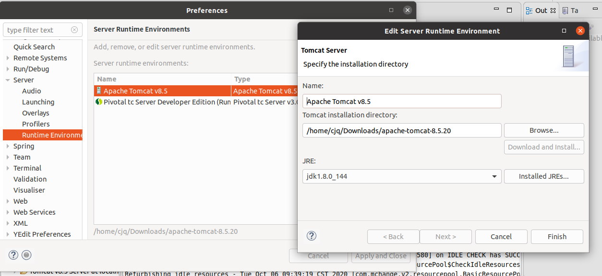
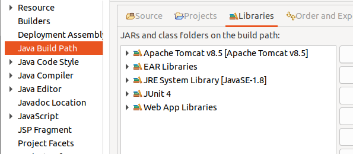
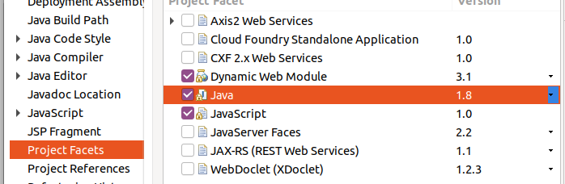
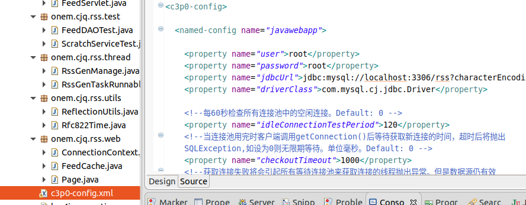
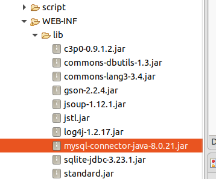
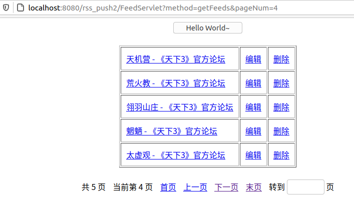
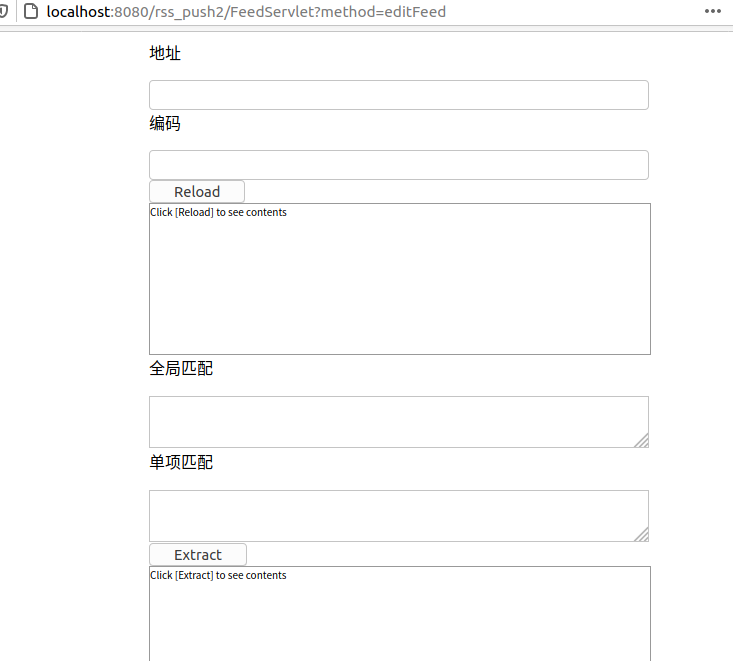

First of all, I want to complain about this project. It's a bit too crude. For the database, I only used the c3p0 database thread pool. I wrote the dao layer manually, and the data rollback was also written manually. The xml files of RSS are all string splicing ,even the dependent packages are not managed by maven. However, this project is really enough. You can use this project like feed43. If you have time and want to transfer the project to springboot and optimize it, I will appreciate you very much.

Talk about how to arrange this project
1. First of all you need to have a separate package of tomcat, its java operating environment and the project operating environment should be consistent, and be configured in this place

   

2. Right-click the project configuration, you need to configure the running environment of tomcat and java

   

   And project facets

   

3. Your database connection pool configuration

   

   Pay attention to the version of your mysql server, you need to import the mysql-connector-java package corresponding to the version

   

4. Import rss_push2.sql, then right-click the project and run, it should be able to run

The running diagram of the project looks like this

